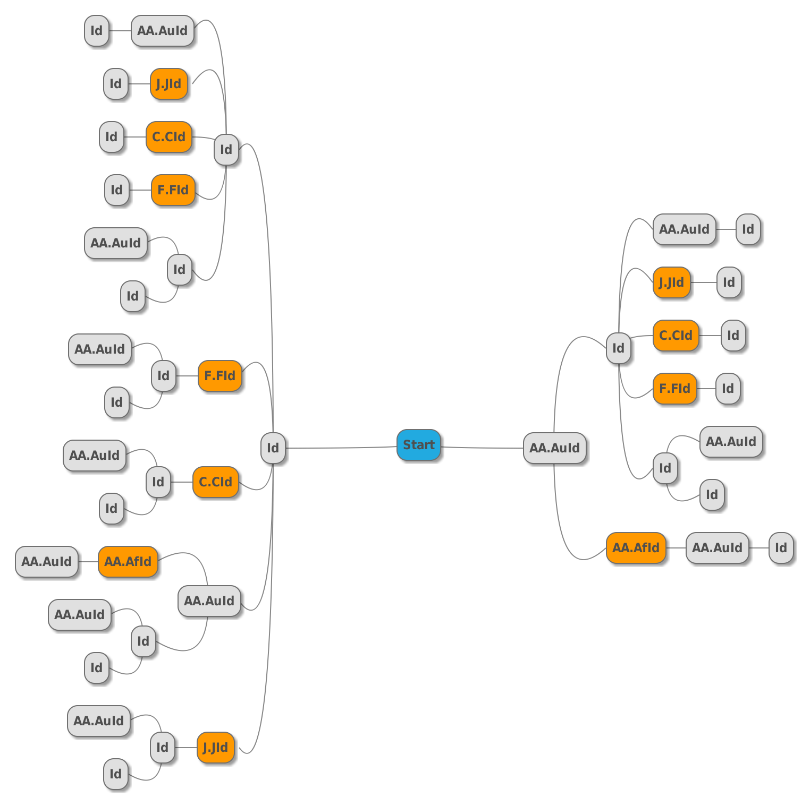

## 任务划分

### 第一阶段

#### 本段阶主要任务介绍：
1. 完成算法流程验证。
2. 设计各步骤主要流程，包括数据处理方式、查询语句构造方式，处理流程分析。
3. 完成系统主要架构设计。
4. 讨论相关实现。

#### 任务划分：
1. 魏来: `Id->AA.AuId->*`、`Id->J.JId->*`等流程的分析。
2. 卞光宇: `Id->F.FId->*`、`Id->C.CId->*`、`AA.AuId->AA.AfId->*`等流程的分析.
3. 罗玄: `Id->Id->*`等流程的分析。

#####注: 以上分析，结果按如下格式给出需要给出如下信息, 且第一阶段即: `Id->*`, `AA.AuId->*`的请求不需要给出。####

1. 请求阶段: `xx->xx->xx`(请给出请求的全路径)
2. 价段分析: xxxxxx(相关说明，如为何这样做，其它相关情况)
3. 数据请求1: from xx get xx
    1. 请求说明
    2. 查询参数
        ```
            expr: xxxx
            count: xxxx
            attributes: xxxx
        ```
    3. 数据处理方式: (如，提取xx字段，做为结果，并如何)
    4. 其它

4. 数据请求2: xxxx
5. 请求数量计算，cost预估。
    ```
    total request: xxx
    total time: xxx (assume the cost per request is "unit")
    ```

#### 请求图

